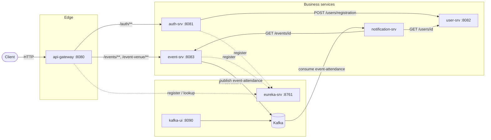
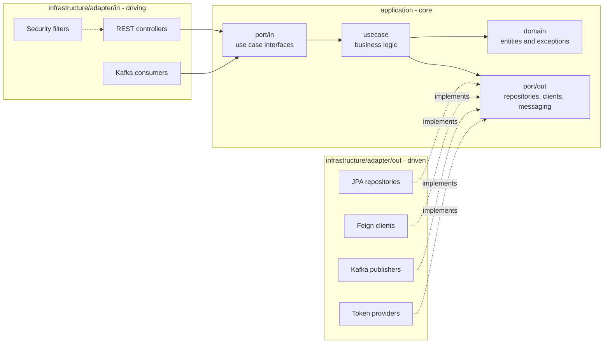
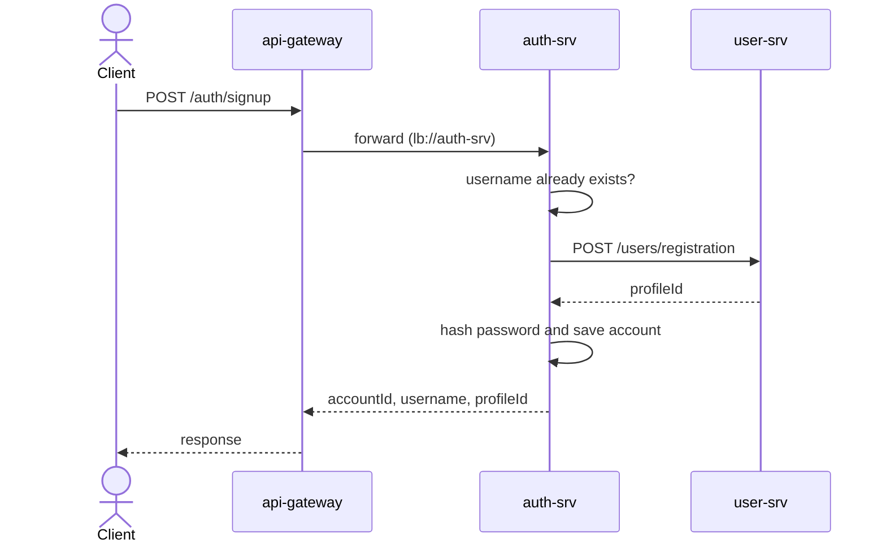
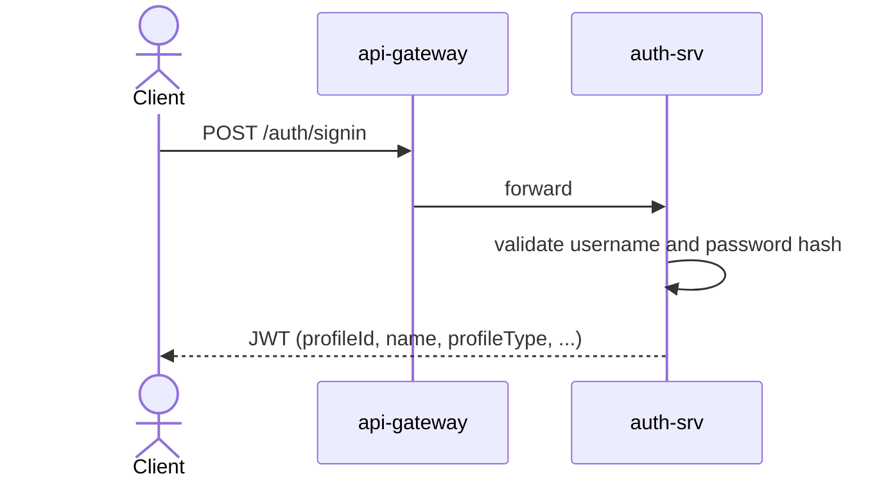
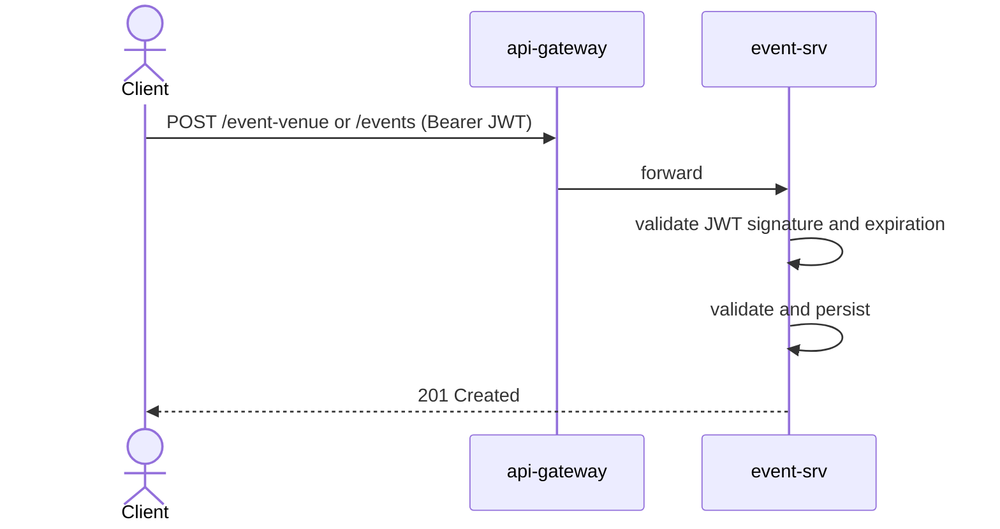
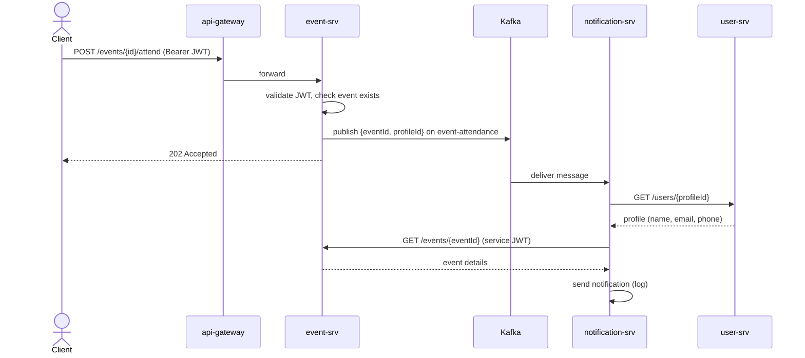

# ticket-flow

Monorepo with all applications and configuration needed to run ticket-flow, an event ticketing platform built as a set of Spring Boot microservices.

## Table of contents

- [Tech stack](#tech-stack)
- [Architecture](#architecture)
- [Hexagonal architecture](#hexagonal-architecture)
- [Services](#services)
- [Information flow](#information-flow)
- [Security model](#security-model)
- [Docker](#docker)
- [Running the project](#running-the-project)
- [Configuration](#configuration)
- [Project structure](#project-structure)

## Tech stack

| Area                       | Technology                                  |
| -------------------------- | ------------------------------------------- |
| Language / runtime         | Java 21                                     |
| Framework                  | Spring Boot, Spring Cloud                   |
| Service discovery          | Netflix Eureka                              |
| API gateway                | Spring Cloud Gateway (Server WebMVC)        |
| Synchronous communication  | REST + OpenFeign                            |
| Asynchronous communication | Apache Kafka 3.9 (KRaft mode, no ZooKeeper) |
| Persistence                | Spring Data JPA, H2 (in-memory)             |
| Batch                      | Spring Batch                                |
| Security                   | Spring Security, JWT (JJWT, HS256)          |
| API docs                   | springdoc-openapi (Swagger UI)              |
| Build / run                | Maven Wrapper, Docker, Docker Compose       |

## Architecture



Key points:

- **Single entry point**: clients only talk to `api-gateway`, which resolves targets through Eureka (`lb://service-name`) and load-balances between instances.
- **Synchronous calls** (REST/Feign) are used when a response is needed immediately (sign-up creating a profile, notification fetching user and event data).
- **Asynchronous calls** (Kafka) are used for fire-and-forget side effects: confirming attendance at an event does not wait for the notification to be sent.
- **Database per service**: each service that persists data owns its own in-memory H2 database. No service reads another service's database.
- **Hexagonal (ports and adapters) structure** in all business services: `application` (domain, ports, use cases) has no dependency on transport or persistence, and `infrastructure` holds the adapters (REST controllers, JPA, Kafka, Feign, security).

## Hexagonal architecture

The business services (`auth-srv`, `user-srv`, `event-srv`, `notification-srv`) follow the hexagonal architecture (ports and adapters). The goal is to keep business rules independent from frameworks, databases and transports, so an adapter (for example the database or the notification channel) can be replaced without touching the core.



| Layer | Package | Responsibility | May depend on |
| --- | --- | --- | --- |
| Domain | `application/domain` | Entities, value objects and domain exceptions | Nothing else |
| Input ports | `application/port/in` | Use case interfaces called by the outside world (`IEventUseCase`) | Domain |
| Use cases | `application/usecase` | Implement the input ports and orchestrate the business rules (`EventUseCase`) | Domain, ports |
| Output ports | `application/port/out` | Interfaces for what the core needs from the outside (`IEventRepository`, `IEventAttendancePublisher`, `ITokenValidator`) | Domain |
| Driving adapters | `infrastructure/adapter/in` | Translate a request (HTTP, Kafka message, JWT) into a use case call, with DTOs and exception handlers | Input ports |
| Driven adapters | `infrastructure/adapter/out` | Implement the output ports with a technology (JPA, Feign, Kafka, JJWT) | Output ports, domain |
| Configuration | `infrastructure/config` | Spring wiring (security, OpenAPI, beans) | Everything |

Rules:

- Dependencies always point inwards: `infrastructure` depends on `application`, never the opposite.
- `application` has no Spring Web, JPA, Kafka or Feign imports; those live only in adapters.
- Controllers talk to use cases through the `port/in` interfaces, and use cases reach databases, other services and brokers through the `port/out` interfaces.
- JPA entities and REST DTOs are separate from the domain model and converted by mappers inside the adapters.

Example, `POST /events/{eventId}/attend` in `event-srv`:

```
EventController (adapter/in)
  -> IEventUseCase (port/in)
     -> EventUseCase (usecase)
        -> IEventRepository (port/out)           <- EventDatabaseAdapter (JPA)
        -> IEventAttendancePublisher (port/out)  <- EventAttendanceKafkaPublisher (Kafka)
```

## Services

| Service              | Port                           | Registered in Eureka    | Exposed through gateway                   | Role                                               |
| -------------------- | ------------------------------ | ----------------------- | ----------------------------------------- | -------------------------------------------------- |
| `eureka-srv`       | 8761                           | No (it is the registry) | No                                        | Service discovery                                  |
| `api-gateway`      | 8080                           | Yes                     | n/a (it is the gateway)                   | Single entry point and routing                     |
| `auth-srv`         | 8081                           | Yes                     | Yes (`/auth/**`)                        | Sign-up, sign-in and JWT issuing                   |
| `user-srv`         | 8082 (internal)                | No                      | No                                        | User profile storage                               |
| `event-srv`        | 8083                           | Yes                     | Yes (`/events/**`, `/event-venue/**`) | Events, venues, attendance and CSV import          |
| `notification-srv` | none                           | No                      | No                                        | Kafka consumer that sends attendance notifications |
| `kafka`            | 29092 (host) / 9092 (internal) | n/a                     | n/a                                       | Message broker                                     |
| `kafka-ui`         | 8090                           | n/a                     | n/a                                       | Web UI to inspect Kafka topics                     |

### eureka-srv

Netflix Eureka server. Runs standalone (`register-with-eureka=false`, `fetch-registry=false`). Dashboard at `http://localhost:8761`.

### api-gateway

Spring Cloud Gateway (WebMVC flavour) with Eureka client and load balancer. Routes:

| Route id      | Predicate (path)                                                   | Target             |
| ------------- | ------------------------------------------------------------------ | ------------------ |
| `auth-srv`  | `/auth/**`                                                       | `lb://auth-srv`  |
| `event-srv` | `/events`, `/events/**`, `/event-venue`, `/event-venue/**` | `lb://event-srv` |

The gateway does not validate tokens; authentication is enforced by the downstream services.

### auth-srv

Owns user credentials (`UserAccount`: username, password hash and a reference to the profile) and issues JWTs.

| Method | Path             | Auth   | Description                                                 |
| ------ | ---------------- | ------ | ----------------------------------------------------------- |
| POST   | `/auth/signup` | Public | Creates the profile in`user-srv`, then stores the account |
| POST   | `/auth/signin` | Public | Validates credentials and returns a Bearer token            |

Sign-up input: `username`, `password`, `name`, `document`, `profileType`, `email`, `phoneNumber`.
Sign-in output: `token`, token type (`Bearer`), expiration in seconds.

JWT claims: `sub`/`accountId`, `username`, `profileId`, `name`, `document`, `profileType`. Signed with HMAC (`jwt.secret`) and valid for `jwt.expiration-seconds` (3600 by default).

Calls `user-srv` through Feign (`POST /users/registration`).

### user-srv

Stores user profiles (`profileId`, `name`, `document`, `profileType`, `email`, `phoneNumber`). It has no security layer and is not registered in Eureka or routed by the gateway: it is only reachable inside the Docker network (`http://user-srv:8082`).

| Method | Path                    | Description                                        |
| ------ | ----------------------- | -------------------------------------------------- |
| POST   | `/users/registration` | Creates a profile (used by`auth-srv`)            |
| GET    | `/users/{id}`         | Gets a profile by id (used by`notification-srv`) |
| GET    | `/users`              | Lists profiles                                     |

### event-srv

Manages events and venues, publishes attendance confirmations and bulk-imports events from CSV. All business endpoints require a valid JWT.

| Method | Path                         | Description                                                                                          |
| ------ | ---------------------------- | ---------------------------------------------------------------------------------------------------- |
| POST   | `/events`                  | Creates an event. The organizer is the`profileId` claim of the token                               |
| GET    | `/events`                  | Lists events                                                                                         |
| GET    | `/events/{eventId}`        | Gets an event                                                                                        |
| POST   | `/events/{eventId}/attend` | Confirms attendance of the authenticated user. Returns`202 Accepted` and publishes a Kafka message |
| POST   | `/event-venue`             | Creates a venue (with address)                                                                       |
| GET    | `/event-venue`             | Lists venues                                                                                         |

Validation rules on event creation: `name`, `eventType`, `startAt`, `status` and organizer are required; `endAt` cannot be before `startAt`; if `venueId` is informed the venue must exist.

**CSV import**: a Spring Batch job (`importEventsJob`, chunk size 100) reads `src/main/resources/import.csv` (`name,description,eventType,startAt,endAt,status,venueId,organizerId`) and saves the rows as events.

**Kafka producer**: topic `event-attendance` (`acks=all`), String key and JSON value.

### notification-srv

Headless worker (no REST API). Consumes attendance messages and sends a notification to the attendee.

- Kafka consumer group `notification-srv`, topic `event-attendance`, `auto-offset-reset=earliest`.
- Invalid messages (missing `eventId` or `profileId`) are discarded with a warning.
- Fetches attendee data from `user-srv` and event data from `event-srv` through Feign.
- Calls to `event-srv` carry a short-lived (5 min) service JWT signed with the shared `JWT_SECRET`.
- The current sender (`LogNotificationSender`) writes the notification to the log. It is behind the `INotificationSender` port, so an email/SMS adapter can replace it without touching the use case.

> The directory is named `norification-srv` (typo kept as-is); the Docker Compose service is `notification-srv`.

### Kafka and Kafka UI

Single-node Kafka in KRaft mode (broker and controller in the same node). Containers use `kafka:9092`; the host uses `localhost:29092`. Kafka UI is available at `http://localhost:8090`.

## Information flow

### 1. Sign-up



### 2. Sign-in



### 3. Event management



### 4. Attendance confirmation and notification



Message published on `event-attendance`:

```json
{ "eventId": "<uuid>", "profileId": "<uuid>" }
```

## Security model

- Authentication is stateless and based on JWT. `auth-srv` is the only issuer.
- `event-srv` validates the token locally using the shared `JWT_SECRET`; `/events/**` and `/event-venue/**` require authentication, any other path is denied. Swagger and H2 console paths are open.
- `notification-srv` generates its own service token with the same secret to call `event-srv`.
- The secret must be identical in `auth-srv`, `event-srv` and `notification-srv`.
- `user-srv` is protected only by network isolation (not published to the host or the gateway). Do not expose it publicly.
- The development H2 consoles (`/h2-console`) and the default secret in `application-dev.yml` are for local use only. Use a strong, private `JWT_SECRET` elsewhere.

## Docker

### Dockerfiles

Every Spring Boot service has its own `Dockerfile` with a multi-stage build:

1. **build** (`eclipse-temurin:21-jdk`): copies `mvnw` and `pom.xml`, downloads the dependencies (`dependency:go-offline`, cached while the `pom.xml` does not change), copies `src` and runs `./mvnw package -DskipTests`.
2. **runtime** (`eclipse-temurin:21-jre`): copies only the generated `*-SNAPSHOT.jar` and starts it with `java -jar app.jar`.

You do not need Java or Maven installed to run the project with Docker: the image build compiles everything.

### Docker Compose

`docker-compose.yml` at the repository root defines the whole environment (one container per service plus Kafka and Kafka UI), all in the same default network, where containers reach each other by service name (`http://user-srv`, `kafka:9092`, `eureka-srv`).

| Container | Image / build | Published port (host) | Depends on |
| --- | --- | --- | --- |
| `eureka-srv` | build `./eureka-srv` | `EUREKA_SRV_PORT` | none |
| `user-srv` | build `./user-srv` | none (internal only) | none |
| `auth-srv` | build `./auth-srv` | `AUTH_SRV_PORT` | `eureka-srv`, `user-srv` |
| `kafka` | `apache/kafka:3.9.0` | `KAFKA_EXTERNAL_PORT` -> 29092 | none |
| `kafka-ui` | `ghcr.io/kafbat/kafka-ui` | `KAFKA_UI_PORT` -> 8080 | `kafka` (healthy) |
| `event-srv` | build `./event-srv` | `EVENT_SRV_PORT` | `eureka-srv`, `kafka` (healthy) |
| `api-gateway` | build `./api-gateway` | `API_GATEWAY_PORT` | `eureka-srv`, `auth-srv` |
| `notification-srv` | build `./norification-srv` | none | `kafka` (healthy), `user-srv`, `event-srv` |

Notes:

- The `kafka` container has a health check (`kafka-broker-api-versions.sh`), so dependent services only start after the broker is ready.
- `depends_on` controls start order only. Services that need Eureka may log connection warnings in the first seconds and register as soon as it is up.
- Configuration is not baked into the images: every container receives its settings as environment variables from the `.env` file (see [Configuration](#configuration)).
- Databases are in-memory H2, so there are no volumes and data is lost when a container restarts.

## Running the project

### With Docker Compose

Requirements: Docker and Docker Compose v2 (`docker compose`). Ports 8080, 8081, 8083, 8090, 8761 and 29092 free on the host (or change them in `.env`).

**1. Clone the repository**

```bash
git clone <repository-url> ticket-flow
cd ticket-flow
```

**2. Create the `.env` file**

Compose does not start without every variable defined. Copy the template and fill it in:

```bash
cp .env.example .env
```

> `.env` holds the shared secret. Never commit it.

**3. Build and start everything**

```bash
docker compose up --build -d
```

The first build downloads the Maven dependencies of every service and can take a few minutes. Later builds reuse the Docker cache.

**4. Check that everything is up**

```bash
docker compose ps
docker compose logs -f event-srv notification-srv
```

Open the Eureka dashboard at `http://localhost:8761`: `API-GATEWAY`, `AUTH-SRV` and `EVENT-SRV` should be listed.

**5. Try the API through the gateway**

```bash
# sign up
curl -X POST http://localhost:8080/auth/signup -H 'Content-Type: application/json' -d '{
  "username": "jane", "password": "s3cret-pass", "name": "Jane Doe",
  "document": "12345678900", "profileType": "ORGANIZER",
  "email": "jane@example.com", "phoneNumber": "+5511999999999"
}'

# sign in and keep the token
TOKEN=$(curl -s -X POST http://localhost:8080/auth/signin -H 'Content-Type: application/json' \
  -d '{"username": "jane", "password": "s3cret-pass"}' | sed -E 's/.*"token":"([^"]+)".*/\1/')

# create an event
curl -X POST http://localhost:8080/events \
  -H "Authorization: Bearer $TOKEN" -H 'Content-Type: application/json' \
  -d '{"name": "Rock Show", "description": "Rock festival", "eventType": "SHOW",
       "startAt": "2026-12-01T20:00:00", "endAt": "2026-12-02T02:00:00", "status": "PUBLISHED"}'

# confirm attendance (use the id returned above); expect 202 Accepted
curl -i -X POST http://localhost:8080/events/<eventId>/attend -H "Authorization: Bearer $TOKEN"
```

After the last call, `docker compose logs notification-srv` shows the notification written by `LogNotificationSender`, and the message is visible in Kafka UI (`http://localhost:8090`, topic `event-attendance`).

**6. Useful commands**

| Goal | Command |
| --- | --- |
| Follow logs of a service | `docker compose logs -f <service>` |
| Rebuild and restart one service | `docker compose up --build -d <service>` |
| Restart one service | `docker compose restart <service>` |
| Stop and remove containers and network | `docker compose down` |
| Same, also removing the built images | `docker compose down --rmi local` |
| Rebuild an image ignoring the cache | `docker compose build --no-cache <service>` |

Troubleshooting:

- `variable is not set` warnings or empty values: a variable is missing in `.env`.
- `401` from `event-srv`: the token expired or `JWT_SECRET` differs between services; recreate the containers after changing it.
- `port is already allocated`: change the matching `*_PORT` variable in `.env`.
- A service is missing in Eureka: wait a few seconds, or check `docker compose logs <service>`.

| URL                                       | What                                     |
| ----------------------------------------- | ---------------------------------------- |
| `http://localhost:8080`                 | API gateway (use this for all API calls) |
| `http://localhost:8761`                 | Eureka dashboard                         |
| `http://localhost:8090`                 | Kafka UI                                 |
| `http://localhost:8081/swagger-ui.html` | auth-srv Swagger                         |
| `http://localhost:8083/swagger-ui.html` | event-srv Swagger                        |

### Locally (dev profile)

Requirements: JDK 21 and a Kafka broker on `localhost:29092` (for example `docker compose up kafka`).

Each service has an `application-dev.yml` with local defaults (Eureka at `localhost:8761`, in-memory H2). Start them in this order, each from its own directory:

```bash
./mvnw spring-boot:run
```

1. `kafka` (via Docker Compose)
2. `eureka-srv`
3. `user-srv`
4. `auth-srv`
5. `event-srv`
6. `norification-srv`
7. `api-gateway`

## Configuration

Docker Compose reads variables from `.env` (template in `.env.example`) and injects them into each container, where `application.yml` resolves them. The `dev` profile (`application-dev.yml`) provides local defaults.

| Group            | Variables                                                                                                                                                              |
| ---------------- | ---------------------------------------------------------------------------------------------------------------------------------------------------------------------- |
| General          | `SPRING_PROFILES_ACTIVE`                                                                                                                                             |
| Eureka           | `EUREKA_SRV_PORT`, `EUREKA_SRV_APPLICATION_NAME`, `EUREKA_INSTANCE_HOSTNAME`, `EUREKA_REGISTER_WITH_EUREKA`, `EUREKA_FETCH_REGISTRY`, `EUREKA_SERVICE_URL` |
| Database / JPA   | `DB_DRIVER_CLASS_NAME`, `DB_USERNAME`, `DB_PASSWORD`, `H2_CONSOLE_ENABLED`, `H2_CONSOLE_PATH`, `JPA_DDL_AUTO`, `JPA_SHOW_SQL`, `JPA_FORMAT_SQL`        |
| user-srv         | `USER_SRV_APPLICATION_NAME`, `USER_SRV_DB_URL`, `USER_SRV_BASE_URL`                                                                                              |
| auth-srv         | `AUTH_SRV_PORT`, `AUTH_SRV_APPLICATION_NAME`, `AUTH_SRV_DB_URL`, `JWT_SECRET`, `JWT_EXPIRATION_SECONDS`                                                      |
| event-srv        | `EVENT_SRV_PORT`, `EVENT_SRV_APPLICATION_NAME`, `EVENT_SRV_DB_URL`, `EVENT_SRV_BASE_URL`                                                                       |
| Kafka            | `KAFKA_EXTERNAL_PORT`, `KAFKA_UI_PORT`, `KAFKA_BOOTSTRAP_SERVERS`, `KAFKA_TOPIC_EVENT_ATTENDANCE`                                                              |
| api-gateway      | `API_GATEWAY_PORT`, `API_GATEWAY_APPLICATION_NAME`                                                                                                                 |
| notification-srv | `NOTIFICATION_SRV_APPLICATION_NAME`, `NOTIFICATION_SRV_KAFKA_GROUP_ID`                                                                                             |

Data is stored in in-memory H2 databases and is lost whenever a service restarts.

## Project structure

Each service is an independent Maven project (own `pom.xml`, Maven Wrapper and `Dockerfile`); there is no parent POM.

```
ticket-flow/
├── docker-compose.yml  # whole environment
├── .env.example        # template of the variables read by Compose
├── eureka-srv/         # service discovery
├── api-gateway/        # routing
├── auth-srv/           # accounts and JWT
├── user-srv/           # profiles
├── event-srv/          # events, venues, attendance, CSV import
└── norification-srv/   # Kafka consumer -> notification
```

Inside each service:

```
<service>/
├── Dockerfile
├── pom.xml
├── mvnw, mvnw.cmd, .mvn/   # Maven Wrapper
└── src/
    ├── main/
    │   ├── java/br/com/<service>/   # code (layout below)
    │   └── resources/               # application.yml, application-dev.yml, import.csv (event-srv)
    └── test/java/                   # tests
```

Business services follow the same package layout (hexagonal architecture, see [Hexagonal architecture](#hexagonal-architecture)):

```
br.com.<service>
├── application
│   ├── domain/        # entities and domain exceptions
│   ├── port/in        # use case interfaces
│   ├── port/out       # interfaces for repositories, clients, messaging
│   └── usecase/       # business logic
└── infrastructure
    ├── adapter/in     # REST controllers, Kafka consumers, security filters
    ├── adapter/out    # JPA, Feign clients, Kafka publishers, token providers
    ├── batch/         # Spring Batch jobs (event-srv)
    └── config/        # Spring configuration
```

Real example, `event-srv`:

```
br.com.eventsrv
├── application
│   ├── domain/{auth,event,venue}/   # entity/ and exceptions/
│   ├── port/in/                     # IEventUseCase, IEventVenueUseCase
│   ├── port/out/                    # IEventRepository, IEventVenueRepository,
│   │                                # IEventAttendancePublisher, ITokenValidator
│   └── usecase/                     # EventUseCase, EventVenueUseCase
└── infrastructure
    ├── adapter/in/{event,venue}/    # controllers, DTOs, exception handlers
    ├── adapter/in/security/         # JwtAuthenticationFilter
    ├── adapter/out/database/        # JPA entities, mappers, repositories
    ├── adapter/out/messaging/       # EventAttendanceKafkaPublisher
    ├── adapter/out/security/        # JwtTokenValidator
    ├── batch/                       # EventImportBatchConfig
    └── config/                      # SecurityConfig, OpenApiConfig
```

`eureka-srv` and `api-gateway` are infrastructure components with just a Spring Boot application class and configuration, so they do not use this layout.
