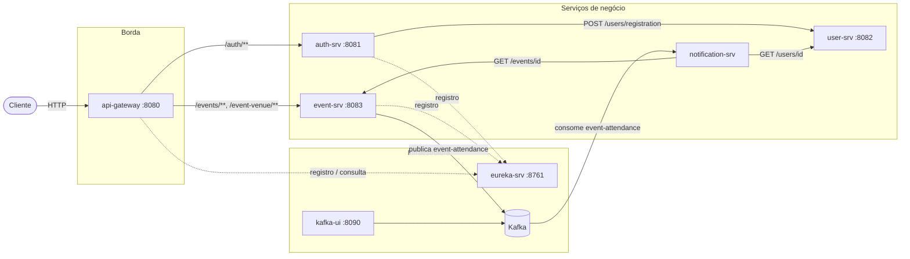
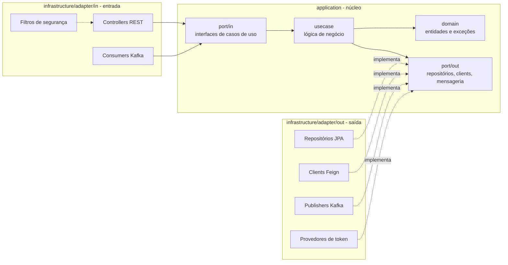
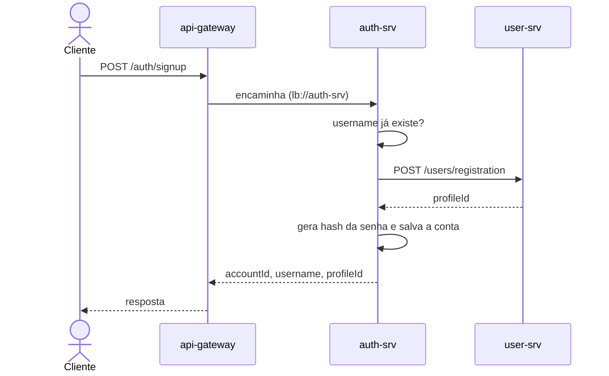
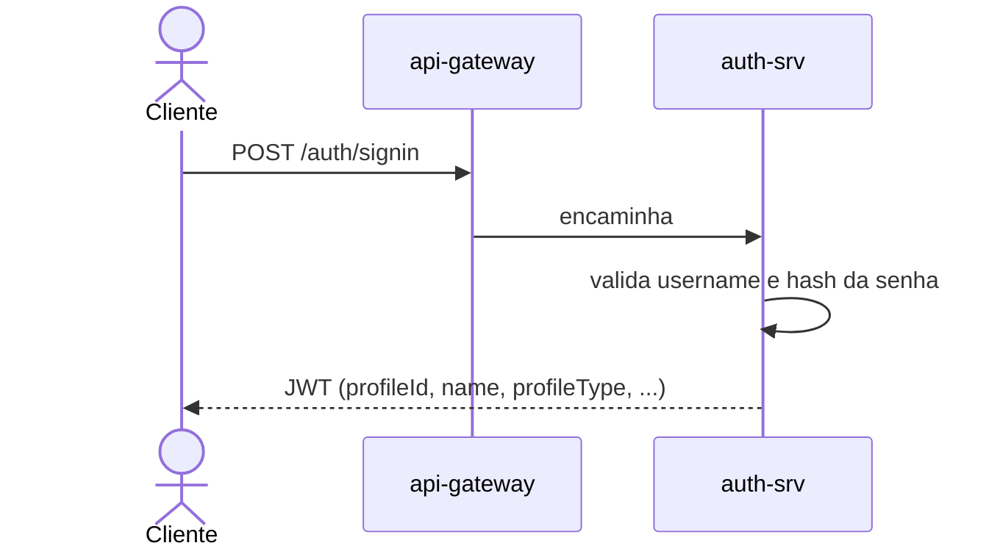
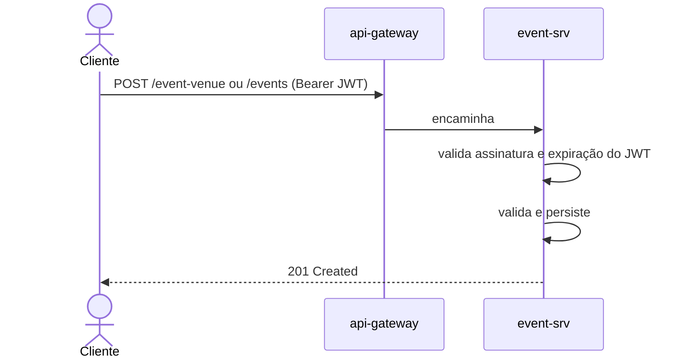
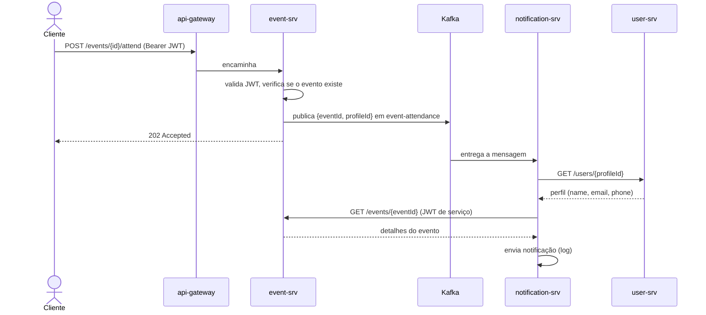

# ticket-flow

Monorepo com todas as aplicações e configurações necessárias para executar o ticket-flow, uma plataforma de venda de ingressos para eventos construída como um conjunto de microsserviços Spring Boot.

## Sumário

- [Stack tecnológica](#stack-tecnológica)
- [Arquitetura](#arquitetura)
- [Arquitetura hexagonal](#arquitetura-hexagonal)
- [Serviços](#serviços)
- [Fluxo de informação](#fluxo-de-informação)
- [Modelo de segurança](#modelo-de-segurança)
- [Docker](#docker)
- [Executando o projeto](#executando-o-projeto)
- [Configuração](#configuração)
- [Estrutura do projeto](#estrutura-do-projeto)

## Stack tecnológica

| Área | Tecnologia |
| --- | --- |
| Linguagem / runtime | Java 21 |
| Framework | Spring Boot, Spring Cloud |
| Descoberta de serviços | Netflix Eureka |
| API gateway | Spring Cloud Gateway (Server WebMVC) |
| Comunicação síncrona | REST + OpenFeign |
| Comunicação assíncrona | Apache Kafka 3.9 (modo KRaft, sem ZooKeeper) |
| Persistência | Spring Data JPA, H2 (em memória) |
| Batch | Spring Batch |
| Segurança | Spring Security, JWT (JJWT, HS256) |
| Documentação da API | springdoc-openapi (Swagger UI) |
| Build / execução | Maven Wrapper, Docker, Docker Compose |

## Arquitetura



Pontos principais:

- **Ponto de entrada único**: os clientes conversam apenas com o `api-gateway`, que resolve os destinos pelo Eureka (`lb://nome-do-servico`) e faz balanceamento de carga entre as instâncias.
- **Chamadas síncronas** (REST/Feign) são usadas quando uma resposta é necessária imediatamente (o cadastro criando um perfil, a notificação buscando dados do usuário e do evento).
- **Chamadas assíncronas** (Kafka) são usadas para efeitos colaterais do tipo "dispare e esqueça": confirmar presença em um evento não espera o envio da notificação.
- **Banco de dados por serviço**: cada serviço que persiste dados possui seu próprio banco H2 em memória. Nenhum serviço lê o banco de outro.
- **Estrutura hexagonal (ports and adapters)** em todos os serviços de negócio: `application` (domínio, ports, casos de uso) não depende de transporte nem de persistência, e `infrastructure` contém os adapters (controllers REST, JPA, Kafka, Feign, segurança).

## Arquitetura hexagonal

Os serviços de negócio (`auth-srv`, `user-srv`, `event-srv`, `notification-srv`) seguem a arquitetura hexagonal (ports and adapters). O objetivo é manter as regras de negócio independentes de frameworks, bancos de dados e meios de transporte, de modo que um adapter (por exemplo o banco de dados ou o canal de notificação) possa ser trocado sem alterar o núcleo.



| Camada | Pacote | Responsabilidade | Pode depender de |
| --- | --- | --- | --- |
| Domínio | `application/domain` | Entidades, value objects e exceções de domínio | Nada além dele |
| Ports de entrada | `application/port/in` | Interfaces de casos de uso chamadas pelo mundo externo (`IEventUseCase`) | Domínio |
| Casos de uso | `application/usecase` | Implementam os ports de entrada e orquestram as regras de negócio (`EventUseCase`) | Domínio, ports |
| Ports de saída | `application/port/out` | Interfaces do que o núcleo precisa do mundo externo (`IEventRepository`, `IEventAttendancePublisher`, `ITokenValidator`) | Domínio |
| Adapters de entrada | `infrastructure/adapter/in` | Traduzem uma requisição (HTTP, mensagem Kafka, JWT) em uma chamada a um caso de uso, com DTOs e exception handlers | Ports de entrada |
| Adapters de saída | `infrastructure/adapter/out` | Implementam os ports de saída com uma tecnologia (JPA, Feign, Kafka, JJWT) | Ports de saída, domínio |
| Configuração | `infrastructure/config` | Configuração do Spring (segurança, OpenAPI, beans) | Tudo |

Regras:

- As dependências sempre apontam para dentro: `infrastructure` depende de `application`, nunca o contrário.
- `application` não possui imports de Spring Web, JPA, Kafka ou Feign; eles ficam apenas nos adapters.
- Os controllers falam com os casos de uso pelas interfaces de `port/in`, e os casos de uso acessam bancos, outros serviços e brokers pelas interfaces de `port/out`.
- Entidades JPA e DTOs REST são separados do modelo de domínio e convertidos por mappers dentro dos adapters.

Exemplo, `POST /events/{eventId}/attend` no `event-srv`:

```
EventController (adapter/in)
  -> IEventUseCase (port/in)
     -> EventUseCase (usecase)
        -> IEventRepository (port/out)           <- EventDatabaseAdapter (JPA)
        -> IEventAttendancePublisher (port/out)  <- EventAttendanceKafkaPublisher (Kafka)
```

## Serviços

| Serviço | Porta | Registrado no Eureka | Exposto pelo gateway | Papel |
| --- | --- | --- | --- | --- |
| `eureka-srv` | 8761 | Não (ele é o registro) | Não | Descoberta de serviços |
| `api-gateway` | 8080 | Sim | n/a (ele é o gateway) | Ponto de entrada único e roteamento |
| `auth-srv` | 8081 | Sim | Sim (`/auth/**`) | Cadastro, login e emissão de JWT |
| `user-srv` | 8082 (interna) | Não | Não | Armazenamento de perfis de usuário |
| `event-srv` | 8083 | Sim | Sim (`/events/**`, `/event-venue/**`) | Eventos, locais, presença e importação de CSV |
| `notification-srv` | nenhuma | Não | Não | Consumidor Kafka que envia notificações de presença |
| `kafka` | 29092 (host) / 9092 (interna) | n/a | n/a | Message broker |
| `kafka-ui` | 8090 | n/a | n/a | Interface web para inspecionar tópicos do Kafka |

### eureka-srv

Servidor Netflix Eureka. Executa de forma standalone (`register-with-eureka=false`, `fetch-registry=false`). Dashboard em `http://localhost:8761`.

### api-gateway

Spring Cloud Gateway (versão WebMVC) com cliente Eureka e load balancer. Rotas:

| Id da rota | Predicado (path) | Destino |
| --- | --- | --- |
| `auth-srv` | `/auth/**` | `lb://auth-srv` |
| `event-srv` | `/events`, `/events/**`, `/event-venue`, `/event-venue/**` | `lb://event-srv` |

O gateway não valida tokens; a autenticação é aplicada pelos serviços downstream.

### auth-srv

Possui as credenciais dos usuários (`UserAccount`: username, hash da senha e uma referência ao perfil) e emite JWTs.

| Método | Path | Auth | Descrição |
| --- | --- | --- | --- |
| POST | `/auth/signup` | Público | Cria o perfil no `user-srv` e depois armazena a conta |
| POST | `/auth/signin` | Público | Valida as credenciais e retorna um token Bearer |

Entrada do signup: `username`, `password`, `name`, `document`, `profileType`, `email`, `phoneNumber`.
Saída do signin: `token`, tipo do token (`Bearer`), expiração em segundos.

Claims do JWT: `sub`/`accountId`, `username`, `profileId`, `name`, `document`, `profileType`. Assinado com HMAC (`jwt.secret`) e válido por `jwt.expiration-seconds` (3600 por padrão).

Chama o `user-srv` via Feign (`POST /users/registration`).

### user-srv

Armazena perfis de usuário (`profileId`, `name`, `document`, `profileType`, `email`, `phoneNumber`). Não possui camada de segurança e não é registrado no Eureka nem roteado pelo gateway: só é acessível dentro da rede Docker (`http://user-srv:8082`).

| Método | Path | Descrição |
| --- | --- | --- |
| POST | `/users/registration` | Cria um perfil (usado pelo `auth-srv`) |
| GET | `/users/{id}` | Busca um perfil por id (usado pelo `notification-srv`) |
| GET | `/users` | Lista perfis |

### event-srv

Gerencia eventos e locais, publica confirmações de presença e importa eventos em lote a partir de CSV. Todos os endpoints de negócio exigem um JWT válido.

| Método | Path | Descrição |
| --- | --- | --- |
| POST | `/events` | Cria um evento. O organizador é o claim `profileId` do token |
| GET | `/events` | Lista eventos |
| GET | `/events/{eventId}` | Busca um evento |
| POST | `/events/{eventId}/attend` | Confirma a presença do usuário autenticado. Retorna `202 Accepted` e publica uma mensagem no Kafka |
| POST | `/event-venue` | Cria um local (com endereço) |
| GET | `/event-venue` | Lista locais |

Regras de validação na criação de evento: `name`, `eventType`, `startAt`, `status` e organizador são obrigatórios; `endAt` não pode ser anterior a `startAt`; se `venueId` for informado, o local deve existir.

**Importação de CSV**: um job do Spring Batch (`importEventsJob`, chunk de 100) lê `src/main/resources/import.csv` (`name,description,eventType,startAt,endAt,status,venueId,organizerId`) e salva as linhas como eventos.

**Producer Kafka**: tópico `event-attendance` (`acks=all`), chave String e valor JSON.

### notification-srv

Worker sem interface (sem API REST). Consome mensagens de presença e envia uma notificação ao participante.

- Consumer group Kafka `notification-srv`, tópico `event-attendance`, `auto-offset-reset=earliest`.
- Mensagens inválidas (sem `eventId` ou `profileId`) são descartadas com um aviso.
- Busca os dados do participante no `user-srv` e os dados do evento no `event-srv` via Feign.
- As chamadas ao `event-srv` carregam um JWT de serviço de curta duração (5 min) assinado com o `JWT_SECRET` compartilhado.
- O sender atual (`LogNotificationSender`) escreve a notificação no log. Ele fica atrás do port `INotificationSender`, então um adapter de e-mail/SMS pode substituí-lo sem alterar o caso de uso.

> O diretório se chama `norification-srv` (erro de digitação mantido); o serviço no Docker Compose é `notification-srv`.

### Kafka e Kafka UI

Kafka de nó único em modo KRaft (broker e controller no mesmo nó). Os containers usam `kafka:9092`; o host usa `localhost:29092`. O Kafka UI está disponível em `http://localhost:8090`.

## Fluxo de informação

### 1. Cadastro (sign-up)



### 2. Login (sign-in)



### 3. Gerenciamento de eventos



### 4. Confirmação de presença e notificação



Mensagem publicada em `event-attendance`:

```json
{ "eventId": "<uuid>", "profileId": "<uuid>" }
```

## Modelo de segurança

- A autenticação é stateless e baseada em JWT. O `auth-srv` é o único emissor.
- O `event-srv` valida o token localmente usando o `JWT_SECRET` compartilhado; `/events/**` e `/event-venue/**` exigem autenticação, qualquer outro path é negado. Os paths do Swagger e do console H2 são abertos.
- O `notification-srv` gera seu próprio token de serviço com o mesmo secret para chamar o `event-srv`.
- O secret deve ser idêntico no `auth-srv`, `event-srv` e `notification-srv`.
- O `user-srv` é protegido apenas por isolamento de rede (não é publicado no host nem no gateway). Não o exponha publicamente.
- Os consoles H2 de desenvolvimento (`/h2-console`) e o secret padrão em `application-dev.yml` são apenas para uso local. Use um `JWT_SECRET` forte e privado em outros ambientes.

## Docker

### Dockerfiles

Todo serviço Spring Boot possui seu próprio `Dockerfile` com build multi-stage:

1. **build** (`eclipse-temurin:21-jdk`): copia `mvnw` e `pom.xml`, baixa as dependências (`dependency:go-offline`, em cache enquanto o `pom.xml` não mudar), copia `src` e executa `./mvnw package -DskipTests`.
2. **runtime** (`eclipse-temurin:21-jre`): copia apenas o `*-SNAPSHOT.jar` gerado e o inicia com `java -jar app.jar`.

Não é necessário ter Java nem Maven instalados para rodar o projeto com Docker: o build das imagens compila tudo.

### Docker Compose

O `docker-compose.yml` na raiz do repositório define todo o ambiente (um container por serviço mais Kafka e Kafka UI), todos na mesma rede padrão, onde os containers se encontram pelo nome do serviço (`http://user-srv`, `kafka:9092`, `eureka-srv`).

| Container | Imagem / build | Porta publicada (host) | Depende de |
| --- | --- | --- | --- |
| `eureka-srv` | build `./eureka-srv` | `EUREKA_SRV_PORT` | nenhum |
| `user-srv` | build `./user-srv` | nenhuma (somente interno) | nenhum |
| `auth-srv` | build `./auth-srv` | `AUTH_SRV_PORT` | `eureka-srv`, `user-srv` |
| `kafka` | `apache/kafka:3.9.0` | `KAFKA_EXTERNAL_PORT` -> 29092 | nenhum |
| `kafka-ui` | `ghcr.io/kafbat/kafka-ui` | `KAFKA_UI_PORT` -> 8080 | `kafka` (healthy) |
| `event-srv` | build `./event-srv` | `EVENT_SRV_PORT` | `eureka-srv`, `kafka` (healthy) |
| `api-gateway` | build `./api-gateway` | `API_GATEWAY_PORT` | `eureka-srv`, `auth-srv` |
| `notification-srv` | build `./norification-srv` | nenhuma | `kafka` (healthy), `user-srv`, `event-srv` |

Observações:

- O container `kafka` possui health check (`kafka-broker-api-versions.sh`), então os serviços dependentes só iniciam depois que o broker estiver pronto.
- `depends_on` controla apenas a ordem de início. Serviços que precisam do Eureka podem registrar avisos de conexão nos primeiros segundos e se registram assim que ele estiver no ar.
- A configuração não é embutida nas imagens: cada container recebe suas definições como variáveis de ambiente a partir do arquivo `.env` (veja [Configuração](#configuração)).
- Os bancos são H2 em memória, então não há volumes e os dados são perdidos quando um container reinicia.

## Executando o projeto

### Com Docker Compose

Requisitos: Docker e Docker Compose v2 (`docker compose`). Portas 8080, 8081, 8083, 8090, 8761 e 29092 livres no host (ou altere-as no `.env`).

**1. Clone o repositório**

```bash
git clone <url-do-repositorio> ticket-flow
cd ticket-flow
```

**2. Crie o arquivo `.env`**

O Compose não sobe sem todas as variáveis definidas. Copie o modelo e preencha:

```bash
cp .env.example .env
```

Exemplo de `.env` funcional para uso local (troque `JWT_SECRET` por um valor seu, com pelo menos 32 caracteres; por exemplo `openssl rand -base64 48`):

```env
SPRING_PROFILES_ACTIVE=dev

# Eureka
EUREKA_SRV_PORT=8761
EUREKA_SRV_APPLICATION_NAME=eureka-srv
EUREKA_INSTANCE_HOSTNAME=eureka-srv
EUREKA_REGISTER_WITH_EUREKA=false
EUREKA_FETCH_REGISTRY=false
EUREKA_SERVICE_URL=http://eureka-srv:8761/eureka/

# Database / JPA
DB_DRIVER_CLASS_NAME=org.h2.Driver
DB_USERNAME=sa
DB_PASSWORD=
H2_CONSOLE_ENABLED=true
H2_CONSOLE_PATH=/h2-console
JPA_DDL_AUTO=update
JPA_SHOW_SQL=false
JPA_FORMAT_SQL=false

# user-srv
USER_SRV_APPLICATION_NAME=user-srv
USER_SRV_DB_URL=jdbc:h2:mem:user-srv;DB_CLOSE_DELAY=-1
USER_SRV_BASE_URL=http://user-srv:8080

# auth-srv
AUTH_SRV_PORT=8081
AUTH_SRV_APPLICATION_NAME=auth-srv
AUTH_SRV_DB_URL=jdbc:h2:mem:auth-srv;DB_CLOSE_DELAY=-1
JWT_SECRET=<seu-secret>
JWT_EXPIRATION_SECONDS=3600

# Kafka
KAFKA_EXTERNAL_PORT=29092
KAFKA_UI_PORT=8090
KAFKA_BOOTSTRAP_SERVERS=kafka:9092
KAFKA_TOPIC_EVENT_ATTENDANCE=event-attendance

# event-srv
EVENT_SRV_PORT=8083
EVENT_SRV_APPLICATION_NAME=event-srv
EVENT_SRV_DB_URL=jdbc:h2:mem:event-srv;DB_CLOSE_DELAY=-1
EVENT_SRV_BASE_URL=http://event-srv:8083

# api-gateway
API_GATEWAY_PORT=8080
API_GATEWAY_APPLICATION_NAME=api-gateway

# notification-srv
NOTIFICATION_SRV_APPLICATION_NAME=notification-srv
NOTIFICATION_SRV_KAFKA_GROUP_ID=notification-srv
```

> O `.env` contém o secret compartilhado. Nunca o versione.

**3. Faça o build e suba tudo**

```bash
docker compose up --build -d
```

O primeiro build baixa as dependências Maven de todos os serviços e pode levar alguns minutos. Os próximos reaproveitam o cache do Docker.

**4. Verifique se tudo subiu**

```bash
docker compose ps
docker compose logs -f event-srv notification-srv
```

Abra o dashboard do Eureka em `http://localhost:8761`: `API-GATEWAY`, `AUTH-SRV` e `EVENT-SRV` devem aparecer na lista.

**5. Teste a API pelo gateway**

```bash
# cadastro
curl -X POST http://localhost:8080/auth/signup -H 'Content-Type: application/json' -d '{
  "username": "jane", "password": "s3cret-pass", "name": "Jane Doe",
  "document": "12345678900", "profileType": "ORGANIZER",
  "email": "jane@example.com", "phoneNumber": "+5511999999999"
}'

# login e guarda o token
TOKEN=$(curl -s -X POST http://localhost:8080/auth/signin -H 'Content-Type: application/json' \
  -d '{"username": "jane", "password": "s3cret-pass"}' | sed -E 's/.*"token":"([^"]+)".*/\1/')

# cria um evento
curl -X POST http://localhost:8080/events \
  -H "Authorization: Bearer $TOKEN" -H 'Content-Type: application/json' \
  -d '{"name": "Show de Rock", "description": "Festival de rock", "eventType": "SHOW",
       "startAt": "2026-12-01T20:00:00", "endAt": "2026-12-02T02:00:00", "status": "PUBLISHED"}'

# confirma presença (use o id retornado acima); esperado 202 Accepted
curl -i -X POST http://localhost:8080/events/<eventId>/attend -H "Authorization: Bearer $TOKEN"
```

Após a última chamada, `docker compose logs notification-srv` mostra a notificação escrita pelo `LogNotificationSender`, e a mensagem pode ser vista no Kafka UI (`http://localhost:8090`, tópico `event-attendance`).

**6. Comandos úteis**

| Objetivo | Comando |
| --- | --- |
| Acompanhar os logs de um serviço | `docker compose logs -f <servico>` |
| Rebuildar e reiniciar um serviço | `docker compose up --build -d <servico>` |
| Reiniciar um serviço | `docker compose restart <servico>` |
| Parar e remover containers e rede | `docker compose down` |
| Idem, removendo também as imagens construídas | `docker compose down --rmi local` |
| Rebuildar uma imagem ignorando o cache | `docker compose build --no-cache <servico>` |

Solução de problemas:

- Avisos `variable is not set` ou valores vazios: falta uma variável no `.env`.
- `401` vindo do `event-srv`: o token expirou ou o `JWT_SECRET` é diferente entre os serviços; recrie os containers após alterá-lo.
- `port is already allocated`: altere a variável `*_PORT` correspondente no `.env`.
- Um serviço não aparece no Eureka: aguarde alguns segundos ou veja `docker compose logs <servico>`.

| URL | O quê |
| --- | --- |
| `http://localhost:8080` | API gateway (use este para todas as chamadas à API) |
| `http://localhost:8761` | Dashboard do Eureka |
| `http://localhost:8090` | Kafka UI |
| `http://localhost:8081/swagger-ui.html` | Swagger do auth-srv |
| `http://localhost:8083/swagger-ui.html` | Swagger do event-srv |

### Localmente (perfil dev)

Requisitos: JDK 21 e um broker Kafka em `localhost:29092` (por exemplo `docker compose up kafka`).

Cada serviço possui um `application-dev.yml` com padrões locais (Eureka em `localhost:8761`, H2 em memória). Inicie-os nesta ordem, cada um a partir do seu próprio diretório:

```bash
./mvnw spring-boot:run
```

1. `kafka` (via Docker Compose)
2. `eureka-srv`
3. `user-srv`
4. `auth-srv`
5. `event-srv`
6. `norification-srv`
7. `api-gateway`

## Configuração

O Docker Compose lê as variáveis do `.env` (modelo em `.env.example`) e as injeta em cada container, onde o `application.yml` as resolve. O perfil `dev` (`application-dev.yml`) fornece padrões locais.

| Grupo | Variáveis |
| --- | --- |
| Geral | `SPRING_PROFILES_ACTIVE` |
| Eureka | `EUREKA_SRV_PORT`, `EUREKA_SRV_APPLICATION_NAME`, `EUREKA_INSTANCE_HOSTNAME`, `EUREKA_REGISTER_WITH_EUREKA`, `EUREKA_FETCH_REGISTRY`, `EUREKA_SERVICE_URL` |
| Banco de dados / JPA | `DB_DRIVER_CLASS_NAME`, `DB_USERNAME`, `DB_PASSWORD`, `H2_CONSOLE_ENABLED`, `H2_CONSOLE_PATH`, `JPA_DDL_AUTO`, `JPA_SHOW_SQL`, `JPA_FORMAT_SQL` |
| user-srv | `USER_SRV_APPLICATION_NAME`, `USER_SRV_DB_URL`, `USER_SRV_BASE_URL` |
| auth-srv | `AUTH_SRV_PORT`, `AUTH_SRV_APPLICATION_NAME`, `AUTH_SRV_DB_URL`, `JWT_SECRET`, `JWT_EXPIRATION_SECONDS` |
| event-srv | `EVENT_SRV_PORT`, `EVENT_SRV_APPLICATION_NAME`, `EVENT_SRV_DB_URL`, `EVENT_SRV_BASE_URL` |
| Kafka | `KAFKA_EXTERNAL_PORT`, `KAFKA_UI_PORT`, `KAFKA_BOOTSTRAP_SERVERS`, `KAFKA_TOPIC_EVENT_ATTENDANCE` |
| api-gateway | `API_GATEWAY_PORT`, `API_GATEWAY_APPLICATION_NAME` |
| notification-srv | `NOTIFICATION_SRV_APPLICATION_NAME`, `NOTIFICATION_SRV_KAFKA_GROUP_ID` |

Os dados são armazenados em bancos H2 em memória e são perdidos sempre que um serviço reinicia.

## Estrutura do projeto

Cada serviço é um projeto Maven independente (`pom.xml`, Maven Wrapper e `Dockerfile` próprios); não há POM pai.

```
ticket-flow/
├── docker-compose.yml  # ambiente completo
├── .env.example        # modelo das variáveis lidas pelo Compose
├── eureka-srv/         # descoberta de serviços
├── api-gateway/        # roteamento
├── auth-srv/           # contas e JWT
├── user-srv/           # perfis
├── event-srv/          # eventos, locais, presença, importação de CSV
└── norification-srv/   # consumidor Kafka -> notificação
```

Dentro de cada serviço:

```
<servico>/
├── Dockerfile
├── pom.xml
├── mvnw, mvnw.cmd, .mvn/   # Maven Wrapper
└── src/
    ├── main/
    │   ├── java/br/com/<servico>/   # código (estrutura abaixo)
    │   └── resources/               # application.yml, application-dev.yml, import.csv (event-srv)
    └── test/java/                   # testes
```

Os serviços de negócio seguem a mesma estrutura de pacotes (arquitetura hexagonal, veja [Arquitetura hexagonal](#arquitetura-hexagonal)):

```
br.com.<service>
├── application
│   ├── domain/        # entidades e exceções de domínio
│   ├── port/in        # interfaces de casos de uso
│   ├── port/out       # interfaces para repositórios, clients, mensageria
│   └── usecase/       # lógica de negócio
└── infrastructure
    ├── adapter/in     # controllers REST, consumers Kafka, filtros de segurança
    ├── adapter/out    # JPA, clients Feign, publishers Kafka, provedores de token
    ├── batch/         # jobs do Spring Batch (event-srv)
    └── config/        # configuração do Spring
```

Exemplo real, `event-srv`:

```
br.com.eventsrv
├── application
│   ├── domain/{auth,event,venue}/   # entity/ e exceptions/
│   ├── port/in/                     # IEventUseCase, IEventVenueUseCase
│   ├── port/out/                    # IEventRepository, IEventVenueRepository,
│   │                                # IEventAttendancePublisher, ITokenValidator
│   └── usecase/                     # EventUseCase, EventVenueUseCase
└── infrastructure
    ├── adapter/in/{event,venue}/    # controllers, DTOs, exception handlers
    ├── adapter/in/security/         # JwtAuthenticationFilter
    ├── adapter/out/database/        # entidades JPA, mappers, repositórios
    ├── adapter/out/messaging/       # EventAttendanceKafkaPublisher
    ├── adapter/out/security/        # JwtTokenValidator
    ├── batch/                       # EventImportBatchConfig
    └── config/                      # SecurityConfig, OpenApiConfig
```

`eureka-srv` e `api-gateway` são componentes de infraestrutura com apenas a classe da aplicação Spring Boot e configuração, portanto não usam essa estrutura.

